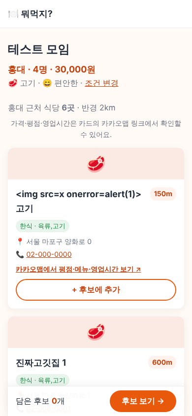
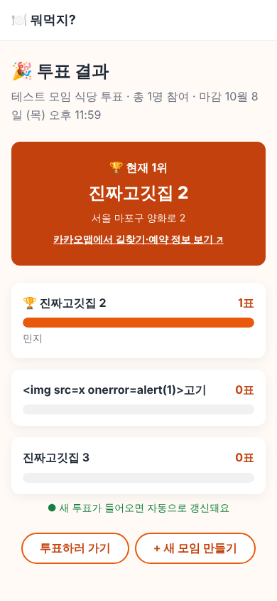

# v0.3 설명서: 실제 식당 검색

## 1. 무엇이 바뀌었나요?

| 전 (v0.2) | 후 (v0.3) |
|---|---|
| 가상의 샘플 식당 149곳 | 카카오맵에 등록된 **실제 식당** (지역 중심 반경 2km, 최대 30곳) |
| 지역은 7곳 중에서만 선택 | **📍 내 주변 (현재 위치)** 선택 가능 |
| 평점·가격 표시 | **거리**, 주소, 전화번호, **카카오맵에서 평점·메뉴·영업시간 보기** 링크 |
| 결과 화면 1위 식당 이름만 | 1위 식당의 **카카오맵 링크** (길찾기) |




키를 넣지 않았거나 검색이 실패하면, 화면 위에 안내 문구와 함께 예전 샘플 식당을 보여줘요. 앱이 멈추지 않아요.

## 2. 카카오 REST API 키 받기

1. [developers.kakao.com](https://developers.kakao.com) 에 카카오 계정으로 로그인
2. 위쪽 **내 애플리케이션** → **애플리케이션 추가하기** → 앱 이름(예: 뭐먹지) 입력 → 저장
3. 만든 앱을 누르고 왼쪽 **앱 키**에서 **REST API 키**를 복사
4. 왼쪽 **카카오맵** (또는 제품 설정 → 카카오맵) 메뉴에서 **사용 설정**을 **ON**
   - 이걸 켜지 않으면 검색할 때 오류(403)가 나요.

## 3. 키 넣기

### 내 컴퓨터 (npm run dev)

`.env.local` 파일 맨 아래에 한 줄 추가하고, 개발 서버를 껐다 켜세요.

```
KAKAO_REST_API_KEY=복사한_REST_API_키
```

### Vercel (배포한 사이트)

Settings → **Environments**(또는 Environment Variables) → Key `KAKAO_REST_API_KEY`, Value 복사한 키 → Production, Preview 체크 → Save → Redeploy

## 4. 왜 VITE_ 를 붙이지 않나요?

- `VITE_` 로 시작하는 값은 **브라우저 코드에 그대로 들어가요.** 누구나 개발자 도구로 볼 수 있어요.
  (Supabase anon 키는 원래 공개용이라 괜찮아요.)
- 카카오 REST API 키는 **비밀**이에요. 남이 가져가면 내 사용량을 써버릴 수 있어요.
- 그래서 브라우저 → **우리 서버(`/api/places`)** → 카카오 순서로 요청해요. 키는 서버에만 있어요.

```
브라우저  ──/api/places?area=홍대&category=meat──▶  Vercel 함수 (api/places.js)
                                                       │ KakaoAK 비밀키
                                                       ▼
                                                   카카오 장소 검색
```

## 5. 새로 생긴 파일

| 파일 | 하는 일 |
|---|---|
| `server/places.js` | 카카오에 검색하고 결과를 앱 모양으로 바꿔요. 지역·음식 종류는 정해진 값만 받아요 |
| `api/places.js` | Vercel 서버 함수. 주소 `/api/places` 로 들어온 요청을 `server/places.js` 에 넘겨요 |
| `vite.config.js` | 개발 서버에서도 `/api/places` 가 동작하게 연결 |
| `src/services/placeService.js` | 화면에서 쓰는 창구. 실패하면 샘플 데이터로 바꿔서 돌려줘요. 현재 위치도 여기서 물어요 |

## 6. 알아둘 점

- 카카오 장소 검색은 **가격·평점·영업시간을 주지 않아요.** 그래서 실제 식당에는 추천 점수 대신 거리를 보여주고, 자세한 정보는 카카오맵 링크로 확인해요.
- 예산·분위기 조건은 아직 실제 식당 검색에 쓰이지 않아요. v0.4(AI)에서 활용할 예정이에요.
- 후보에 담을 때 식당 정보를 함께 저장해요. 검색 결과가 나중에 달라져도 후보 목록은 그대로예요.
- "내 주변"은 위치를 소수 4자리(약 10m)까지만 서버에 보내요. 위치 권한을 거부하면 지역을 직접 고르라는 안내가 나와요.
- 무료 사용량은 카카오 개발자 콘솔의 앱 → **쿼터** 메뉴에서 확인할 수 있어요. 같은 검색은 Vercel이 1시간 기억해 둬서 호출이 줄어요.
