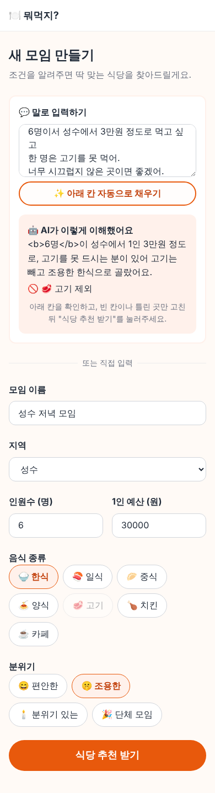
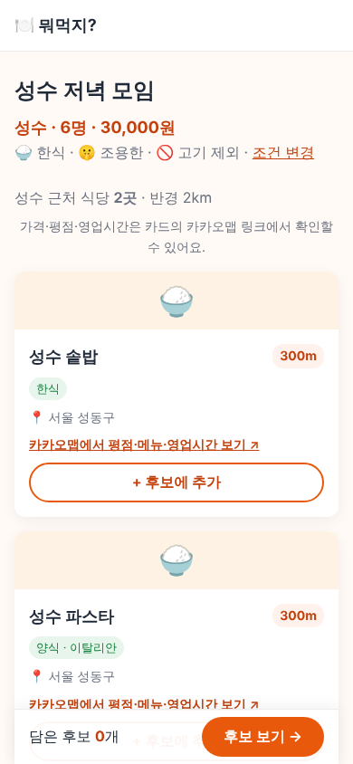

# v0.4 설명서: 말로 조건 입력하기 (AI)

## 1. 무엇이 바뀌었나요?

모임 만들기 화면 위에 **💬 말로 입력하기** 칸이 생겼어요.

```
6명이서 성수에서 3만원 정도로 먹고 싶고
한 명은 고기를 못 먹어.
너무 시끄럽지 않은 곳이면 좋겠어.
```

이렇게 쓰고 **✨ 아래 칸 자동으로 채우기**를 누르면:

| 칸 | 채워지는 값 |
|---|---|
| 지역 | 성수 |
| 인원 | 6명 |
| 1인 예산 | 30,000원 |
| 분위기 | 🤫 조용한 |
| 음식 종류 | 🥩 고기는 **고를 수 없게** 줄이 그어져요 |

추천 화면에는 "🚫 고기 제외"가 표시되고, 업종이 고기·육류인 식당은 목록에서 빠져요.




채운 뒤에도 칸을 직접 고칠 수 있어요. AI는 "입력 도우미"이고 최종 결정은 사람이 해요.

## 2. 두 가지 방식

| | AI 방식 (Claude) | 규칙 방식 |
|---|---|---|
| 언제 | `ANTHROPIC_API_KEY`가 있을 때 | 키가 없거나 AI 호출이 실패할 때 (자동) |
| 똑똑함 | "총 18만원" → 1인 3만원으로 나누기, 모임 이름 제안, 이해한 내용 설명 | 정해진 단어만 찾아요 (홍대·연남, 고기·삼겹, 조용·시끄럽지 않…) |
| 비용 | 유료 (아래 참고) | 무료 |

키를 넣지 않아도 규칙 방식으로 위 예시 문장은 잘 채워져요. 음식 종류는 직접 골라야 할 수 있어요.

## 3. Claude API 키 받기 (선택)

1. [console.anthropic.com](https://console.anthropic.com) 가입 → 로그인
2. **Billing** 에서 크레딧 충전 (선불, 최소 금액은 화면에서 확인)
3. **API Keys** → **Create Key** → 키 복사 (`sk-ant-...` 로 시작, 다시 볼 수 없으니 바로 복사)
4. Vercel → Settings → Environments(Environment Variables) → **Add Environment Variable**
   - Type: **Secret**, Key: `ANTHROPIC_API_KEY`, Value: 복사한 키, Production + Preview
5. Redeploy

내 컴퓨터에서는 `.env.local`에 `ANTHROPIC_API_KEY=키` 한 줄 추가 후 개발 서버 재시작.

**비용**: 모델은 Claude Opus 5.5, 생각 깊이(effort)는 가장 낮은 `low`로 설정했어요. 문장 하나 정리에 대략 1센트(10~20원) 이하가 들 것으로 예상해요. 실제 금액은 콘솔의 **Usage**에서 확인하세요. 300자가 넘는 글은 서버가 받지 않아요.

## 4. 어떻게 동작하나요?

```
브라우저 ──POST /api/parse { text }──▶ Vercel 함수 (api/parse.js → server/parse.js)
   ▲                                         │ ANTHROPIC_API_KEY (비밀)
   │                                         ▼
   │                                   Claude (정해진 JSON 모양으로만 답하게)
   │◀── { area, people, budget, category, atmosphere, avoid, notes } ──┘
   │
   └─ 실패하면 src/utils/parseText.js (규칙 방식)로 정리
```

- **정해진 모양으로만 답하기 (structured outputs)**: AI에게 JSON 틀(스키마)을 주면 반드시 그 모양으로 답해요. 지역은 7곳 + 내 주변 중에서만, 음식 종류도 7개 중에서만 고를 수 있어요.
- 서버가 AI 답을 한 번 더 확인해요 (인원 1~100, 예산 1,000~1,000,000원이 아니면 비움).
- AI 설명(notes)은 화면에 넣기 전에 HTML 태그를 글자로 바꿔요.
- AI가 안전 문제로 답을 거절하면 다른 모델로 자동 재시도해요 (`fallbacks: "default"`).

## 5. 새로 생긴 파일

| 파일 | 하는 일 |
|---|---|
| `server/parse.js` | Claude에게 문장을 보내고 조건 JSON을 받아요 |
| `api/parse.js` | Vercel 서버 함수 (`POST /api/parse`) |
| `src/utils/parseText.js` | 규칙 방식 (무료, 키 없을 때) |
| `src/services/aiService.js` | AI를 먼저 시도하고, 안 되면 규칙 방식으로 |
| `src/pages/CreateGroup.js` | 말로 입력하기 칸, 폼 자동 채우기 |
| `src/pages/Recommendations.js` | 못 먹는 음식 종류의 식당 빼기 |
